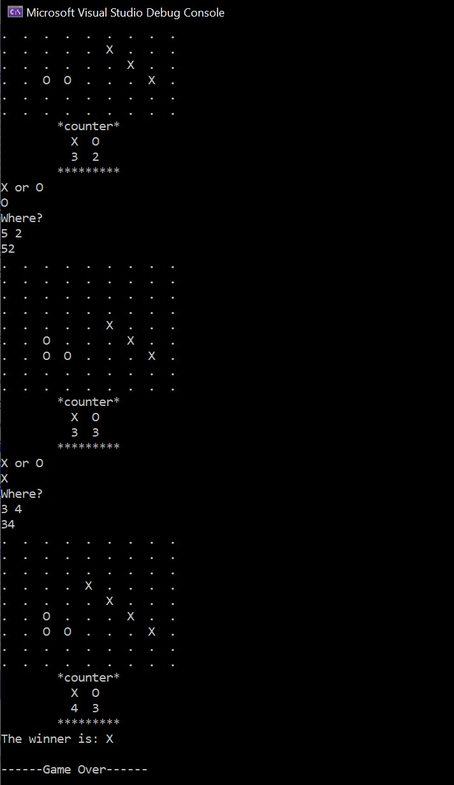

# C-Tic-Tac-Toe-game-9-9-board-
/*
********************************
C++ Tic-Tac-Toe game (9*9 board)
********************************
Developer: Fiavi Y.
Data: 12/18/2020
********************************
Players: 2.  X v.s. O
Playing time: ~5 minutes

This is a Tic-tac-toe "ish" game.
On a 9*9 playing board, the player who succeeds in placing *four* of their marks (X or O) 
in a diagonal, horizontal, or vertical row is the winner.

The program is able to:

Implement the game.
 
 Detect the winner.
 
 Check whether a coordinate is already occupied.
 
 Track the numbers of X and O on the borad.
**/

This is what it looks like running in the windows console

